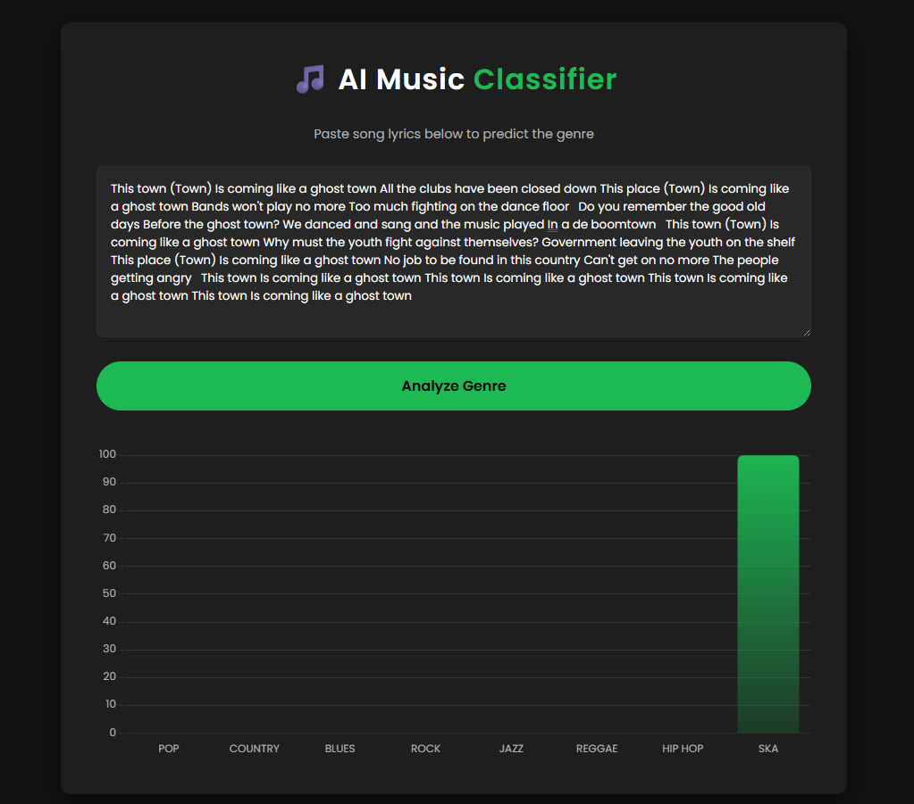

# Music Genre Classifier — Apache Spark MLlib

## UI Preview



A machine-learning application that classifies song lyrics into music genres using **Apache Spark MLlib** (Naive Bayes + TF-IDF). The project contains three main parts:

1. **`scraper.py`** — scrapes Ska song lyrics from the Genius API and merges them with an existing Mendeley dataset to produce an 8-genre dataset.
2. **`model/train.py`** — PySpark script that trains a Naive Bayes text-classification pipeline and saves the model to disk.
3. **`app/`** — a Java/Maven Spark application that loads the saved model and exposes a web UI (running on `http://127.0.0.1:5000`) where you can paste lyrics and see genre probabilities.

---

## Table of Contents

- [Prerequisites](#prerequisites)
- [Project Structure](#project-structure)
- [Configuration](#configuration)
- [Step 1 — Build the Dataset (optional)](#step-1--build-the-dataset-optional)
- [Step 2 — Train the Model](#step-2--train-the-model)
- [Step 3 — Build the Web App](#step-3--build-the-web-app)
- [Step 4 — Run the Web App](#step-4--run-the-web-app)
- [How It Works](#how-it-works)

---

## Prerequisites

Make sure the following are installed and available on your `PATH` before you begin:

| Tool | Version | Purpose |
|---|---|---|
| [Java JDK](https://adoptium.net/) | 11+ | Running Spark and the web server |
| [Apache Spark](https://spark.apache.org/downloads.html) | 3.5.x | Spark runtime / `spark-submit` |
| [Apache Maven](https://maven.apache.org/download.cgi) | 3.6+ | Building the Java web-app JAR |
| [Python](https://www.python.org/downloads/) | 3.8+ | Running the scraper and training scripts |
| [PySpark](https://pypi.org/project/pyspark/) | 3.5.x | Python Spark bindings for training |
| [lyricsgenius](https://pypi.org/project/lyricsgenius/) | any | Genius API client (scraper only) |
| [pandas](https://pypi.org/project/pandas/) | any | CSV handling (scraper only) |

Install the Python dependencies:

```bash
pip install pyspark lyricsgenius pandas
```

> **Windows users:** The `run.bat` launcher requires `spark-submit` to be on your `PATH`. Add `%SPARK_HOME%\bin` to your system `PATH` variable.

---

## Project Structure

```
music-classifier-MLlib/
├── Mendeley_dataset.csv        # Original 7-genre dataset (Hip-Hop, Pop, Rock, etc.)
├── Student_dataset.csv         # Scraped Ska songs (generated by scraper.py)
├── Merged_dataset.csv          # Final 8-genre dataset used for training
├── scraper.py                  # Step 1: scrapes Ska lyrics and merges datasets
├── model/
│   ├── train.py                # Step 2: trains the Spark ML pipeline
│   └── trained_lyrics_model/   # Saved model (generated by train.py)
├── app/
│   ├── pom.xml                 # Maven build file
│   └── src/main/java/
│       └── MusicApp.java       # Step 3/4: Spark web server
└── run.bat                     # Windows launcher (builds + runs the app)
```

---

## Configuration

### Genius API Token (required for Step 1 only)

`scraper.py` fetches lyrics via the [Genius API](https://genius.com/api-clients). If you need to regenerate the Ska dataset:

1. Create a free account at <https://genius.com/api-clients>.
2. Click **New API Client** and copy your **Client Access Token**.
3. Open `scraper.py` and replace the placeholder token on line 7:

```python
GENIUS_API_TOKEN = 'YOUR_TOKEN_HERE'
```

> **Skip this step if `Merged_dataset.csv` already exists** in the repository root — you can go straight to training.

---

## Step 1 — Build the Dataset (optional)

> Skip if `Merged_dataset.csv` is already present.

This script scrapes up to 100 Ska songs from 10 artists, saves them to `Student_dataset.csv`, then concatenates them with `Mendeley_dataset.csv` to create `Merged_dataset.csv`.

```bash
# Run from the repository root
python scraper.py
```

Expected output:
```
Starting to scrape songs... This might take a few minutes.
Searching for The Specials...
...
Saved 100 songs to Student_dataset.csv
Merged_dataset.csv created successfully!
```

---

## Step 2 — Train the Model

The training script runs two phases:

- **Phase 1** — trains on the original 7-genre Mendeley dataset and prints its test accuracy.
- **Phase 2** — re-trains on the full 8-genre merged dataset and saves the final model to `model/trained_lyrics_model/`.

```bash
# Run from the model/ directory
cd model
python train.py
```

Expected output (accuracy values will vary):
```
Booting local Spark Session...
--- PHASE 1: Training on Original 7-Class Mendeley Dataset ---
Phase 1 (7 Classes) Test Accuracy: 0.8512
--- PHASE 2: Re-training on 8-Class Merged Dataset ---
Phase 2 (8 Classes) Test Accuracy: 0.8390
SUCCESS: Final 8-class model saved to 'trained_lyrics_model' folder!
```

> Training can take several minutes depending on your hardware.

---

## Step 3 — Build the Web App

Compile the Java application into a JAR using Maven:

```bash
# Run from the app/ directory
cd app
mvn clean package -q
```

This produces `app/target/MusicClassifier-1.0.jar`.

---

## Step 4 — Run the Web App

### Windows (recommended — one-click launcher)

From the repository root, double-click **`run.bat`** or run it from a command prompt:

```bat
run.bat
```

The script will:
1. Launch the Spark web server in the background via `spark-submit`.
2. Wait 15 seconds for the server to start.
3. Open `http://127.0.0.1:5000` in your default browser.
4. Press any key to shut the server down when you are done.

### macOS / Linux (manual)

```bash
# Run from the repository root
spark-submit --class MusicApp --master local[*] app/target/MusicClassifier-1.0.jar
```

Then open `http://127.0.0.1:5000` in your browser.

---

## How It Works

```
Song Lyrics (text input)
        │
        ▼
  RegexTokenizer       — splits lyrics into words
        │
        ▼
  StopWordsRemover     — removes common English stop words
        │
        ▼
  HashingTF            — converts word list to a sparse term-frequency vector (10,000 features)
        │
        ▼
  IDF                  — down-weights terms that appear in many songs
        │
        ▼
  Naive Bayes          — probabilistic classifier trained on 8 genres
        │
        ▼
Genre probabilities (displayed as a bar chart in the browser)
```

**Supported genres:** Hip-Hop, Pop, Rock, Country, Jazz, R&B, Reggae, Ska
